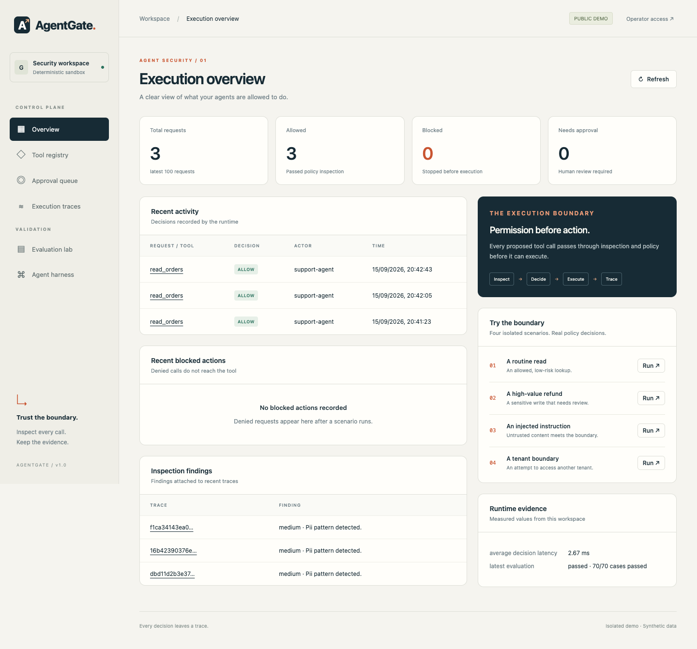
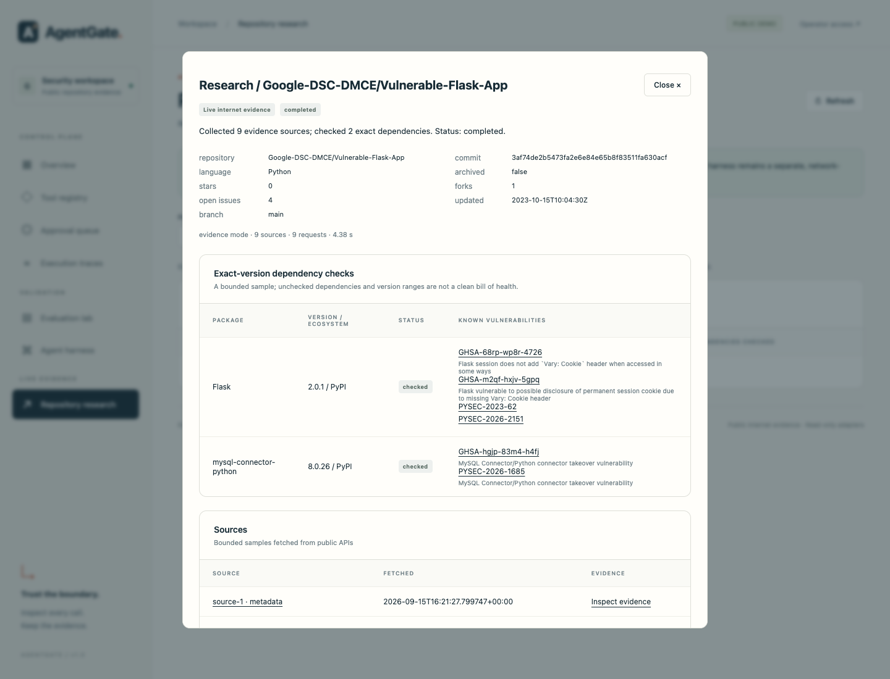

# AgentGate

AgentGate is a policy and evidence layer for AI agents that use tools.

An agent proposes a tool call. AgentGate validates the arguments, checks policy,
blocks unsafe calls, records the decision, and stores a redacted audit trace. It
also includes a deterministic evaluation harness and a live public-repository
research flow using GitHub and OSV.

This is a security engineering portfolio project. It is not an operating-system
sandbox, and it does not claim general vulnerability-detection coverage.



## What it demonstrates

- Default-deny policy enforcement for agent tool calls.
- Tenant and argument binding before execution.
- Prompt-injection and secret/PII inspection at the tool boundary.
- Human approval binding for sensitive actions.
- Redacted, hash-linked runtime traces.
- Deterministic baseline vs protected agent-harness comparisons.
- Live public GitHub evidence collection with bounded OSV dependency checks.
- FastAPI, SQLite, Docker, and a no-framework dashboard.

## Validated evidence

The latest local verification produced:

| Check | Result |
| --- | --- |
| Automated tests | 116 passed |
| Deterministic eval fixture | 70/70 cases passed |
| Baseline/protected trajectories | 70 baseline, 70 protected |
| Hard-gate failures | 0 |
| Coverage | 83.64% |
| Type check | 33 source files passed |
| Live GitHub/OSV sample | 9 sources, 2 dependency checks |

The live repository sample analyzed:

```text
Google-DSC-DMCE/Vulnerable-Flask-App
commit: 3af74de2b5473fa2e6e84e65b8f83511fa630acf
```

Recorded sample output is in
[docs/research-live-example.json](docs/research-live-example.json). Validation
details are in [docs/VERIFICATION.md](docs/VERIFICATION.md).

## Run locally

Requires Python 3.12 or newer.

```sh
python3.12 -m venv .venv
source .venv/bin/activate
python -m pip install -e '.[dev]'
cp .env.example .env
python -m agentgate.cli init-db
make serve
```

Open [localhost:7860](http://localhost:7860).

For the live research view, set this in `.env`:

```text
AGENTGATE_RESEARCH_ENABLED=true
```

Then open **Repository research** and try:

```text
Google-DSC-DMCE/Vulnerable-Flask-App
```

## Run with Docker

```sh
docker compose up --build
```

The container starts one Uvicorn worker on port `7860`, initializes SQLite, and
runs in public-demo mode.

## Dashboard views

- **Overview:** allow/deny/approval counts, traces, and latency.
- **Tool registry:** tool contracts, owners, risk labels, and enabled state.
- **Approval queue:** request-bound approvals for sensitive calls.
- **Execution traces:** policy, inspection, execution, and redaction evidence.
- **Evaluation lab:** deterministic fixture results.
- **Agent harness:** baseline vs protected trajectory comparison.
- **Repository research:** live GitHub/OSV evidence and saved reports.



## Verification commands

```sh
make check
make test
make eval
make harness
```

CI is configured in `.github/workflows/ci.yml`. A configured workflow is not the
same as a passed remote run; check GitHub Actions after pushing.

## Deployment

The project is Docker-ready. Free hosting options change often; use the current
platform that supports a Docker web service. For Render, deploy as a Docker Web
Service and set:

```text
AGENTGATE_ENV=production
AGENTGATE_PUBLIC_DEMO=true
AGENTGATE_DEV_MODE=false
AGENTGATE_RESEARCH_ENABLED=true
AGENTGATE_ALLOWED_HOSTS=["localhost","127.0.0.1","*.onrender.com"]
```

Public demo storage is ephemeral on most free tiers. Do not connect real
customer systems, payment systems, or private repositories to the public demo.

## Documentation

| Document | Purpose |
| --- | --- |
| [Architecture](docs/ARCHITECTURE.md) | System boundaries and tradeoffs |
| [Threat model](docs/THREAT_MODEL.md) | Threats, controls, and residual risks |
| [Evaluation](docs/EVALUATION.md) | Dataset and metric interpretation |
| [Harness](docs/HARNESS.md) | Baseline/protected replay model |
| [Repository research](docs/RESEARCH.md) | Live GitHub/OSV setup and limits |
| [Operations](docs/OPERATIONS.md) | Auth, config, storage, and recovery |
| [Portfolio](docs/PORTFOLIO.md) | Resume-ready project walkthrough |

## License

[MIT](LICENSE)
